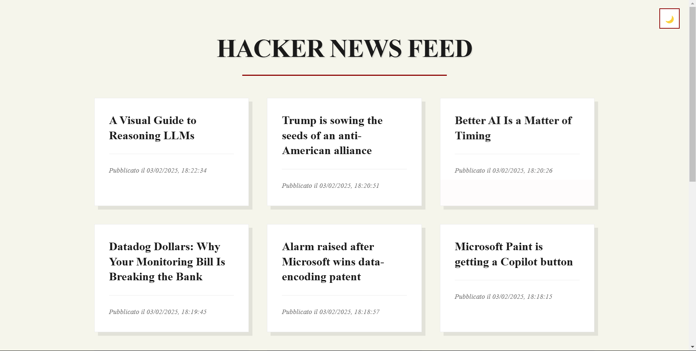
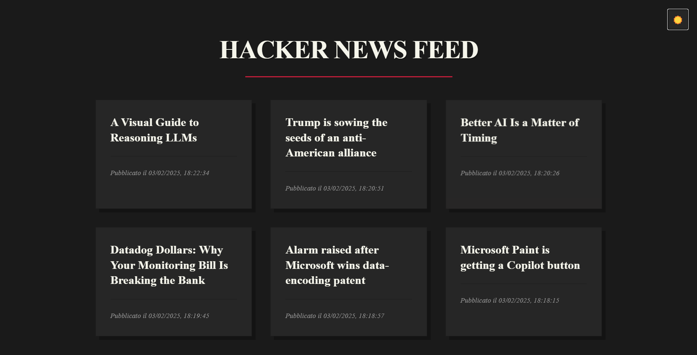

# Hacker News Feed 📰

An elegant news reader with dynamic theme switching and smooth animations, built to provide a comfortable reading experience.

[](./public/image/screen-light.png)
[](./public/image/screen-dark.png)

## Features 🚀

- Dynamic news loading system
- Light/Dark theme with smooth transitions
- Elegant animations and hover effects
- Error handling with user feedback
- Responsive grid layout

## Installation ⚙️

```bash
# Clone repository
git clone https://github.com/yourusername/hacker-news-feed.git

# Install dependencies
npm install

# Create your environment file (contact repository owner for access)
touch .env

# Start development server
npm run dev
```

## Theme Customization 🎨

Customize the appearance by modifying these CSS variables:

```css
:root {
  --background: #f5f5eb;
  --text: #1a1a1a;
  --card-bg: #ffffff;
  --accent: #8b0000;
  --shadow: rgba(0, 0, 0, 0.08);
  --meta-text: #666666;
}

[data-theme="dark"] {
  --background: #1a1a1a;
  --text: #f5f5eb;
  --card-bg: #262626;
  --accent: #c41e3a;
  --shadow: rgba(0, 0, 0, 0.25);
  --meta-text: #999999;
}
```

## Tech Stack 💻

- HTML5
- CSS3 with Custom Properties
- JavaScript ES6+
- Axios for API calls
- Webpack for bundling
- Lodash for utilities

## Project Structure 📁

```
src/
├── js/
│   ├── api.js
│   ├── newsManager.js
│   ├── ui.js
│   └── index.js
└── css/
    └── style.css
```

## Access and Contribution 🔑

This project requires specific environment variables to function. Please contact the repository owner for access and contribution guidelines.

## License 📄

[MIT](./LICENSE)

---

_Made with ❤️ by [Matteo Ratto]_
